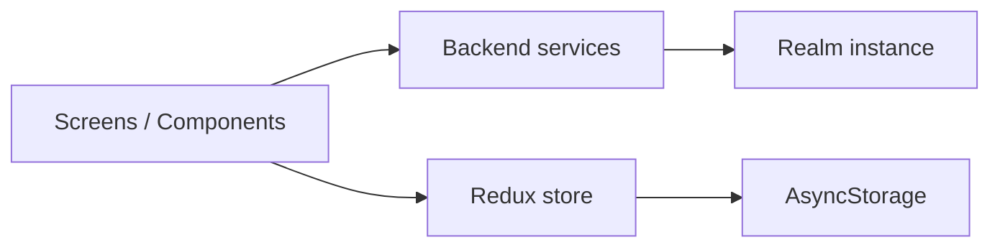

# Architecture

## High-level pattern

**Single React Native application** inside an Nx monorepo. The app follows a **layered, feature-oriented** layout:

1. **Composition root** — `apps/MOBILE/src/main.tsx` registers the root component `BlackWhite` → `apps/MOBILE/src/app/App.tsx`.
2. **Cross-cutting providers** — Redux `Provider`, `PersistGate`, `SafeAreaProvider`, custom `ThemeProvider`, `PortalHost`, then `NavigationContainer` + `AppNavigator` (`apps/MOBILE/src/app/App.tsx`).
3. **Navigation** — React Navigation: bottom tabs for main areas, native stack for modal-style flows like user details (`apps/MOBILE/navigation/index.tsx`).
4. **Screens** — Top-level route components under `apps/MOBILE/screens/` (e.g. `HomeScreen.tsx`, `InvoicesScreen.tsx`, `CustomersScreen.tsx`, `UserDetailsScreen.tsx`).
5. **UI kit** — Reusable primitives under `apps/MOBILE/components/ui/` (Card, Text, Modal, etc.) and feature folders (`components/users`, `components/invoices`, `components/customers`).
6. **Data layer** — **Realm** as the system of record; **service singletons** encapsulate queries and writes (`apps/MOBILE/backend/services/*Service.ts`). **Plain DTOs** decouple UI from Realm proxies (`apps/MOBILE/backend/realmHelpers.ts`).
7. **Client state** — Redux Toolkit for a small slice set (e.g. `counter` in `apps/MOBILE/store/slices/counterSlice.ts`) with persistence optional per whitelist.

## Data flow (simplified)

- **Reads/writes to business entities** (users, orders, invoices) go through services that call `getRealm()` and return **plain objects** via `toPlainUser` / similar helpers.
- **Theme and ephemeral UI state** can use hooks and Redux; persisted Redux uses encrypt + AsyncStorage.

## Entry points

| Role             | File                               |
| ---------------- | ---------------------------------- |
| RN registration  | `apps/MOBILE/src/main.tsx`         |
| App shell        | `apps/MOBILE/src/app/App.tsx`      |
| Navigation graph | `apps/MOBILE/navigation/index.tsx` |
| Realm bootstrap  | `apps/MOBILE/backend/realm.ts`     |
| Redux store      | `apps/MOBILE/store/index.ts`       |

## Abstractions

- **Path aliases:** `@mobile/...` for app-internal imports; `@/` also maps to app root in Babel (`apps/MOBILE/babel.config.js`).
- **Typing for navigation:** `RootStackParamList`, `BottomTabParamList` in `apps/MOBILE/utils/types/` (navigation types).
- **Theming:** NativeWind `useColorScheme` + shared constants in `apps/MOBILE/utils/constants/`; design tokens package for CSS variables (`libs/design-tokens`).

## Nx integration

- Custom **run-commands** targets for Android lifecycle live in `apps/MOBILE/project.json`.
- Metro uses `withNxMetro` from `@nx/react-native` (`apps/MOBILE/metro.config.js`) so the app participates in the workspace graph.

## Design notes

- Tab labels mix English and Arabic strings (`apps/MOBILE/navigation/index.tsx`), indicating a localized or bilingual product direction.
- **Singleton services** (`UserService.getInstance()`, etc.) provide a simple service-locator style without a DI container.
