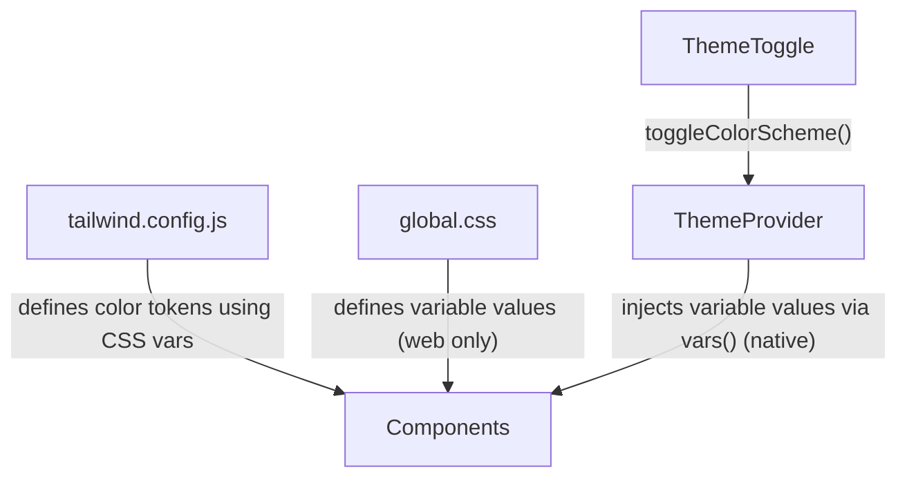

# NativeWind Theme Setup — Walkthrough

## Architecture Overview



> [!CAUTION]
> **CSS `:root` / `.dark` selectors do NOT work on React Native.** They only work on web. On native, you must use NativeWind's `vars()` function to inject CSS variable values via inline styles on a wrapper `View`. This is the most common gotcha when porting Tailwind themes to React Native.

---

## Setup Steps

### 1. [tailwind.config.js](file:///mnt/malek/github/50dFeterk/Fterak50d/tailwind.config.js) — Define color tokens

Add `darkMode: "class"` and map colors to CSS variables:

```js
module.exports = {
  darkMode: "class",
  content: ["./App.tsx", "./components/**/*.{js,jsx,ts,tsx}"],
  presets: [require("nativewind/preset")],
  theme: {
    extend: {
      colors: {
        background: "rgb(var(--color-background) / <alpha-value>)",
        foreground: "rgb(var(--color-foreground) / <alpha-value>)",
        primary: "rgb(var(--color-primary) / <alpha-value>)",
        secondary: "rgb(var(--color-secondary) / <alpha-value>)",
        muted: "rgb(var(--color-muted) / <alpha-value>)",
        accent: "rgb(var(--color-accent) / <alpha-value>)",
      },
    },
  },
  plugins: [],
};
```

### 2. [global.css](file:///mnt/malek/github/50dFeterk/Fterak50d/global.css) — Variable values (web only)

These `:root`/`.dark` values work on web but **are ignored on native**:

```css
@tailwind base;
@tailwind components;
@tailwind utilities;

@layer base {
  :root {
    --color-background: 255 255 255;
    --color-foreground: 10 10 10;
    /* ... */
  }
  .dark {
    --color-background: 10 10 10;
    --color-foreground: 245 245 245;
    /* ... */
  }
}
```

### 3. [ThemeProvider.tsx](file:///mnt/malek/github/50dFeterk/Fterak50d/components/ThemeProvider.tsx) — Inject vars on native ⭐

This is the **critical piece** that makes CSS variables work on React Native:

```tsx
import { View } from 'react-native';
import { vars, useColorScheme } from 'nativewind';

const lightTheme = vars({
  '--color-background': '255 255 255',
  '--color-foreground': '10 10 10',
  // ... all your color variables
});

const darkTheme = vars({
  '--color-background': '10 10 10',
  '--color-foreground': '245 245 245',
  // ... dark values
});

export function ThemeProvider({ children }) {
  const { colorScheme } = useColorScheme();
  return (
    <View style={colorScheme === 'dark' ? darkTheme : lightTheme} className="flex-1">
      {children}
    </View>
  );
}
```

### 4. [App.tsx](file:///mnt/malek/github/50dFeterk/Fterak50d/App.tsx) — Wrap with ThemeProvider

```tsx
<SafeAreaProvider>
  <ThemeProvider>        {/* ← injects CSS vars */}
    <SafeAreaView className="flex-1 bg-background">
      {/* all children can use bg-background, text-foreground, etc. */}
    </SafeAreaView>
  </ThemeProvider>
</SafeAreaProvider>
```

### 5. [ThemeToggle.tsx](file:///mnt/malek/github/50dFeterk/Fterak50d/components/ThemeToggle.tsx) — Toggle switch

Uses `useColorScheme().toggleColorScheme()` from nativewind with animated sun/moon switch.

---

## Color Token Reference

| Token | Class | Light | Dark |
|---|---|---|---|
| background | `bg-background` | white | near-black |
| foreground | `text-foreground` | near-black | near-white |
| primary | `bg-primary` / `text-primary` | blue-500 | blue-400 |
| secondary | `text-secondary` | slate-500 | slate-400 |
| muted | `bg-muted` | slate-100 | slate-800 |
| accent | `bg-accent` | indigo-500 | indigo-400 |

## Usage

Just use the token names — they auto-switch between light/dark:

```tsx
<View className="bg-background">
  <Text className="text-foreground">Auto-themed text</Text>
  <Text className="text-secondary">Subtle text</Text>
  <View className="bg-muted p-4 rounded-lg">
    <Text className="text-primary">Accent text</Text>
  </View>
</View>
```

> [!IMPORTANT]
> **No `dark:` prefix needed** for the custom token colors. They switch automatically via [ThemeProvider](file:///mnt/malek/github/50dFeterk/Fterak50d/components/ThemeProvider.tsx#27-37).
> You can still use `dark:` with standard Tailwind colors (e.g. `bg-white dark:bg-black`).

## Key Considerations

| Topic | Detail |
|---|---|
| **Web vs Native** | [global.css](file:///mnt/malek/github/50dFeterk/Fterak50d/global.css) variables work on web; [ThemeProvider](file:///mnt/malek/github/50dFeterk/Fterak50d/components/ThemeProvider.tsx#27-37) with `vars()` is needed on native |
| **Adding new colors** | Add to 3 places: [tailwind.config.js](file:///mnt/malek/github/50dFeterk/Fterak50d/tailwind.config.js) colors, [ThemeProvider](file:///mnt/malek/github/50dFeterk/Fterak50d/components/ThemeProvider.tsx#27-37) light/dark objects, and [global.css](file:///mnt/malek/github/50dFeterk/Fterak50d/global.css) (for web) |
| **StatusBar** | Must be handled separately with `barStyle` and `backgroundColor` props |
| **SafeAreaView** | Use `SafeAreaView` from `react-native-safe-area-context`, not from `react-native` (deprecated) |
| **Metro restart** | Always restart Metro after changing [tailwind.config.js](file:///mnt/malek/github/50dFeterk/Fterak50d/tailwind.config.js) or [global.css](file:///mnt/malek/github/50dFeterk/Fterak50d/global.css) |
